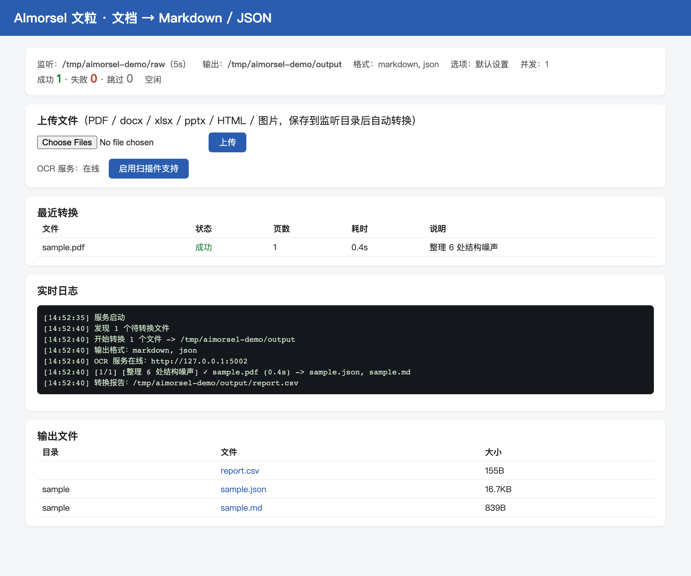
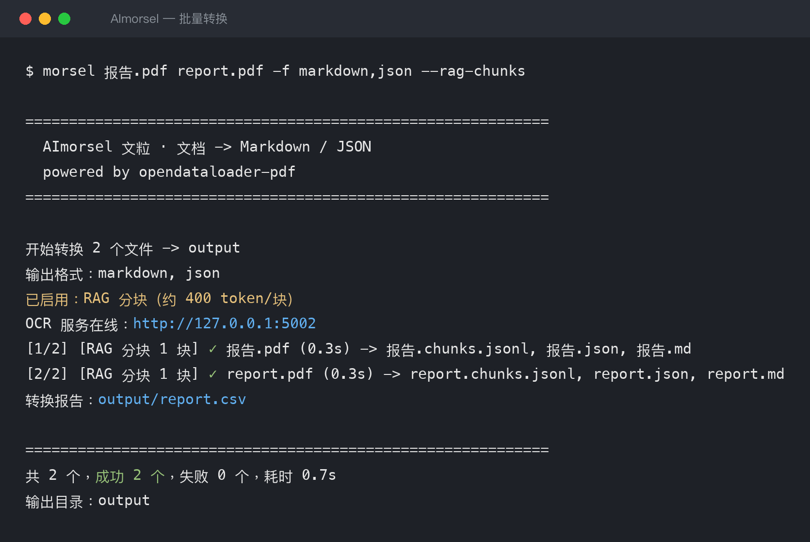
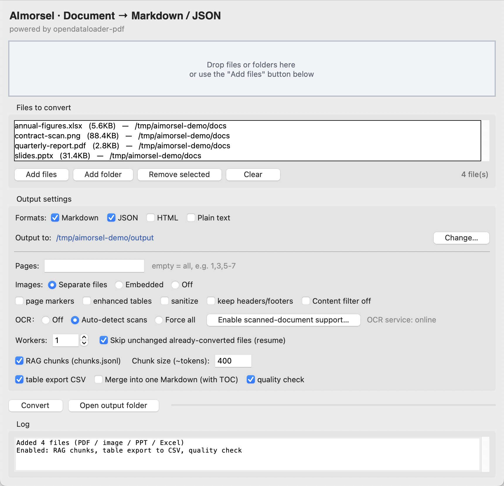
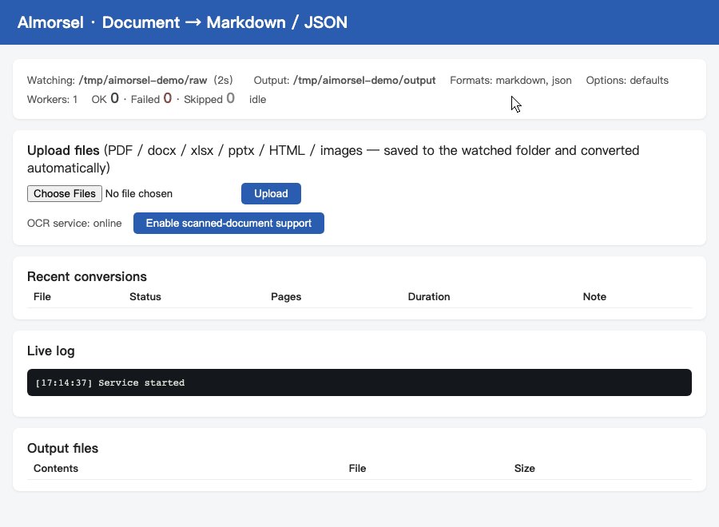

# AImorsel

**Document → Markdown / JSON converter**

**中文**: [README.md](README.md) | **English**: this page

A local document-extraction tool that converts **PDF, Word (docx), Excel (xlsx),
PowerPoint (pptx), HTML pages and images** into structured Markdown, JSON, HTML or plain text.
PDF layout analysis is powered by
[opendataloader-pdf](https://github.com/opendataloader-project/opendataloader-pdf),
wrapped in a friendly CLI, GUI, web service and MCP server.

**Fully offline — your files never leave your machine.** Ideal for papers,
reports, contracts and course material that must not be uploaded to online services.



## What it does

It recovers **structured content** — heading hierarchy, paragraphs, lists and
tables — rather than a soup of plain text. For PDFs it also keeps the page
number, bounding box, font and font size of every element.

Supported input formats:

| Format | Notes |
|---|---|
| `.pdf` | Main path: full layout analysis (headings / tables / coordinates / fonts) |
| `.docx` | Word: heading levels, lists and tables preserved (whole file counts as page 1) |
| `.xlsx` | Excel: each worksheet is one "page"; tables become Markdown tables / CSV |
| `.pptx` | PowerPoint: each slide is one "page", speaker notes included |
| `.html` / `.htm` | Web pages: headings / paragraphs / lists / tables in reading order, scripts and styles dropped (whole file counts as page 1; stdlib parser, no extra dependency) |
| Images (png/jpg/tiff/bmp/webp/gif) | Wrapped into a PDF and routed through the OCR channel (requires the OCR service) |

Batch conversion, resumable runs, RAG chunking, table export and folder
watching all work identically across every format — mixed folders are fine.

Two typical outputs:

- **Markdown** — clean body text: read it, archive it, or feed it to an LLM
- **JSON** — the full structure tree, ideal for programmatic post-processing

## Requirements

**Python 3.10+** and **Java 11+** (the layout engine is written in Java;
`opendataloader-pdf` requires Python ≥ 3.10).

```bash
java -version                      # check Java
pip install -r requirements.txt    # install dependencies
```

On macOS, the easiest way to get Java:

```bash
brew install --cask temurin
```

The core dependency is `opendataloader-pdf` (ships its own JAR). Everything else
is optional: `tkinterdnd2` (GUI drag & drop), `pdfplumber` (fallback extraction +
fast scanned-file probing), `pikepdf` (repairs damaged / truncated PDFs before conversion), `python-docx` / `openpyxl` / `python-pptx` / `pillow`
(docx/xlsx/pptx/image input; HTML uses the standard library, no extra dependency). A missing library only disables its own feature,
and the error message tells you the exact `pip install` command.

> Prefer zero setup? Grab the standalone build from GitHub Releases — it bundles
> a trimmed JRE, so neither Python nor Java is needed.

## Quick start

Drop files into `raw/`, then:

```bash
python3 morsel.py
```

Pick files, pick formats, hit Enter — results appear in `output/`.

Commands on this page are written for **running from source** (`python3 morsel.py …`).
With the packaged build installed the command is `morsel`, and the three secondary
entry points are subcommands:

```bash
morsel report.pdf      # convert; same as python3 morsel.py report.pdf
morsel gui             # graphical interface
morsel web             # resident web service
morsel mcp             # MCP server (for agents)
```

A real file **or directory** named `gui`/`web`/`mcp` in the current directory wins
(`web/` and `gui/` are common directory names, so `morsel web` must not become
"start the service"). You get a one-line note when that happens; use the standalone
commands `morsel-gui` / `morsel-web` / `morsel-mcp` to start those instead.



## Command line

### Direct conversion

```bash
python3 morsel.py report.pdf                  # single file
python3 morsel.py raw/                        # whole folder, recursive
python3 morsel.py a.pdf b.docx -f markdown    # multiple files, Markdown only
python3 morsel.py raw/ -o ~/Desktop/out       # custom output directory
python3 morsel.py secret.pdf -p mypassword    # encrypted PDF
```

Basic options:

| Option | Description | Default |
|---|---|---|
| `-f, --format` | Output formats, comma-separated: `markdown` `json` `html` `text` `pdf` | `markdown,json` |
| `-o, --output` | Output directory | `output/` |
| `-p, --password` | Password for encrypted PDFs | — |

The `pdf` format produces an **annotated PDF** — every detected block outlined
in color on top of the original page, great for verifying layout detection.

Advanced options:

| Option | Description |
|---|---|
| `--pages 1,3,5-7` | Convert only the given pages |
| `--images off/embedded/external` | Image handling (default: external files) |
| `--page-markers` | Insert page separators into Markdown / text |
| `--better-tables` | Enhanced table detection (better for borderless tables) |
| `--sanitize` | Redact emails / phones / IDs / credit cards / IPs |
| `--header-footer` | Keep headers and footers (dropped by default) |
| `--keep-all-content` | Disable content filtering (keep hidden / off-page / tiny text) |
| `--threads N` | Per-page parallelism for large files (experimental) |

OCR options (for scanned documents, see "Scanned documents & OCR"):

| Option | Description |
|---|---|
| `--ocr off/auto/force` | OCR mode: auto-detect scanned files (**default: auto**) / never / always |
| `--ocr-url URL` | OCR service address (default `http://127.0.0.1:5002`) |

Batch options:

| Option | Description |
|---|---|
| `--jobs N` | Parallel worker processes (default 1) |
| `--force` | Ignore resume records, reconvert everything |
| `--no-report` | Skip the `report.csv` conversion report |
| `--watch` | Watch mode: keep monitoring the folder, convert new/changed files |
| `--watch-interval SEC` | Watch polling interval (default 5s) |

**Resume is on by default**: every successful conversion is recorded in
`output/.done.json`. Re-running a batch skips files that are already converted
and unchanged; edited files or changed options trigger reconversion automatically.

Every batch also writes **`report.csv`** — status, page count, outputs,
duration, OCR usage and failure reason per file.

AI-oriented processing:

| Option | Description |
|---|---|
| `--rag-chunks` | Split content by heading hierarchy + token budget into `<name>.chunks.jsonl` |
| `--chunk-size N` | Target tokens per chunk (default 400) |
| `--export-tables` | Export every table as CSV into `<name>_tables/` |
| `--merge` | Merge the batch into a single `merged.md` with a table of contents |
| `--qa` | Quality check: annotated PDF + per-page stats in `<name>.qa.csv` |

Each chunk is one JSON line with full provenance — page range, heading path,
token estimate:

```json
{"chunk": 5, "source": "report.pdf", "pages": [1, 1], "heading_path": ["1 Infrastructure", "1.1 Compute"], "tokens": 144, "content": "## 1.1 Compute\n\n..."}
```

### config.toml

Put your usual options into `config.toml` (a fully commented template ships with
the repo). Config values only change the *defaults* — explicit CLI flags always win.

```toml
[convert]
format = "markdown"

[batch]
jobs = 4

[rag]
enabled = true
chunk_size = 400
```

## GUI

```bash
python3 morsel_gui.py
```



Drag files or folders in, tick output formats and advanced options, watch the
log as the batch runs in a background thread. Single-file failures never abort
the batch. Same conversion engine as the CLI.

## Web service

A local web page plus folder watching, meant to run in the background:

```bash
python3 morsel_web.py                # open http://127.0.0.1:8008
python3 morsel_web.py --port 9000 --input ~/Dropbox/inbox
```

Upload documents from the browser, watch the live log, download any output.
Conversion options come from `config.toml`. Binds to `127.0.0.1` only by
default; there is no access control, so don't expose it to untrusted networks.



## MCP server (for AI agents)

`morsel_mcp.py` exposes the converter to Claude Code and other MCP clients —
pure stdlib, stdio transport. Register it (see `.mcp.json.example`) and an agent
gets 8 tools, including **progressive disclosure** for reading large documents
without wasting context:

- `get_outline` — heading tree with per-section token counts (a few hundred tokens)
- `get_section` — fetch one section by heading, fuzzy matched
- `search_documents` — full-text search across everything you've converted,
  hits include page numbers and heading paths
- plus `convert_pdf`, `read_pdf_markdown`, `extract_tables`, `get_chunks`, `qa_check`

## Output layout

Each input gets its own subdirectory, so same-named outputs never collide:

```
output/
├── report.csv          # batch report
├── .done.json          # resume ledger
├── annual-report/
│   ├── annual-report.md
│   ├── annual-report.json
│   └── annual-report.chunks.jsonl
└── meeting-notes/
    └── ...
```

## Scanned documents & OCR

Scanned (image-only) PDFs have no text layer. The tool detects them
automatically (`--ocr auto`, the default) and routes them to a local OCR
service. One-click setup (recommended):

```bash
python3 morsel.py --setup-ocr          # isolated env + dependencies (several GB) + start
python3 morsel.py --stop-ocr           # stop the managed service
```

The GUI and web UI have an "Enable scanned-document support" button that does
the same, with progress in the log panel. Everything installs into
`~/.aimorsel/ocr-env`; uninstall = delete that directory. Manual alternative:

```bash
pip install "opendataloader-pdf[hybrid]"
opendataloader-pdf-hybrid --port 5002 --ocr-lang "ch_sim,en"
```

Match `--ocr-lang` to your documents' language — it is the single biggest
quality factor. Without the service, scanned files degrade gracefully to
layout-only output with a clear note.

## Fallback safety net

If the Java engine rejects a file as `not a valid PDF file (corrupted or truncated
content)` — a half-downloaded file, a broken cross-reference table — the tool first
rebuilds the file structure with `pikepdf` (qpdf) and feeds the repaired copy to the
engine again. When that works you get the **full structure tree, not a degraded
result**; the note reads "PDF structure was damaged; repaired (qpdf) and converted".
Only if the engine still fails does it fall back to pdfplumber plain-text
extraction, mark the row as "degraded" in `report.csv`, and keep the batch going.
A corrupt file never takes down your run. (Without `pikepdf` installed the repair
step is skipped.)

MathML formulas in HTML input (Wikipedia and the like) are kept as LaTeX text:
inline `$n-1$`, display formulas `$$…$$` on their own line (source preference:
`<annotation encoding="application/x-tex">`, then `alttext`, then the MathML
tokens; image-only fallbacks use `alt`).

The same "degraded" status is used for image inputs converted while the OCR
service is down: the output has no text (just the layout of one picture), so it
is never reported as a plain success. The log marks it `△`, the summary line
counts "degraded/no-text" rows, and the manifest remembers it is waiting for
OCR — start the service and rerun the same command and those images are
reconverted automatically (no `--force` needed; watch mode picks them up on the
next round too). The Web panel and MCP tool results show the same status. An
image that still yields no text with OCR online is retried at most twice, then
treated as blank.

## Benchmark: where we stand

Short version: **format coverage and speed are our strengths; plain-text fidelity is on par
with docling and pymupdf4llm; scans and images are the weak spot for every tool, ours included.**

The benchmark lives in [`bench/`](bench/): corpus manifest, download scripts, ground-truth
generators, metric implementations (each with unit tests), the batch runner and the full
result tables are all in the repository — rerunning the same manifest reproduces the numbers
within 1%. **Full results and the reading caveats are in [`bench/RESULTS.md`](bench/RESULTS.md)**;
that file opens with eight caveats you need in order not to misread the tables (how formulas
are scored, how table markup drags character similarity down, which engines only ran a subset).
Every number below comes from it.

### Corpus: 731 documents × 5 engines = 3,224 records

- **Sources**: 542 real documents from 12 public sources — arXiv (CC-BY subset, LaTeX source
  included), EUR-Lex (parallel multilingual texts), UN ODS (the same document in six official
  languages), SEC EDGAR 10-K, CNINFO annual reports, OpenStax textbooks, IETF RFCs, Japan e-Gov
  statutes, gesetze-im-internet, FUNSD / XFUND scanned forms — plus 189 programmatically
  generated files whose structure is known exactly.
- **Formats**: 253 text-layer PDF · 40 scanned PDF · 188 images (66 png / 81 jpg / 41 tiff) ·
  172 HTML · 36 docx · 21 pptx · 21 xlsx
- **Languages**: 227 en · 143 zh · 94 de · 84 es · 74 fr · 64 ja · 27 ru · 18 ar
- **Domains**: 205 law · 186 business/filings · 114 IT · 91 math/academic · 75 government ·
  44 education · 8 medical · 8 news
- **Ground truth**: 628 documents are "exact" — parsed from the source file itself (arXiv LaTeX,
  the HTML edition of EUR-Lex/RFC documents, the known structure of generated files).
  **No human scoring, no LLM-as-judge.** The remaining 103 (government and financial PDFs with
  no source file) use a five-engine consensus as a pseudo ground truth, for relative comparison only.

### What the metrics mean

| Metric | Meaning |
|---|---|
| char_sim ↑ | character-level similarity to the ground truth (0–1, whitespace stripped) |
| CER ↓ | character error rate |
| heading F1 ↑ | F1 over the set of heading texts (fuzzy match ≥ 0.9) |
| cell F1 ↑ | per-cell text F1 after table alignment |
| order τ ↑ | Kendall τ of paragraph reading order |
| digit F1 ↑ | multiset precision/recall/F1 over digit strings; **`1 − digit precision` is the share of numbers that were invented** |
| compat residual ↓ | leftover Kangxi radicals / compatibility ideographs / ligatures — code points that look right but break `grep`; should be 0 |
| RTL visual order ↓ | documents stored in visual order (Arabic etc.; no characters lost, but search and tokenization break); should be 0 |
| s/doc, peak RSS | median and p95 on the same macOS machine (Apple silicon CPU, no GPU) |

### Coverage: how many of the 731 each engine converted

| Engine | Accepts | Converted out of 731 | Compat residual | RTL visual order |
|---|---|---|---|---|
| **AImorsel** | all 8 format classes | **731 (100%)** | 0 | 0 / 25 |
| docling | comparable (only ran a 300-doc stratified subset — ~11 s/doc, too slow for the full run) | 299 / 300 | 0 | 0 / 6 |
| pymupdf4llm | PDF only | 293 (40.1%) | 0 | 0 / 10 |
| markitdown | most formats except images/scans | 539 (73.7%) | 4 | 10 / 25 |
| pdfplumber (plain text) | PDF only | 289 (39.5%) | 0 | 10 / 10 |

Unsupported formats count as failures — this column answers "drop a mixed folder in, how much
comes out". The last two columns are **silent** failures: markitdown and pdfplumber emit ten
Arabic documents in visual order, with every character present but search and tokenization broken.

### Quality: pairwise, on the documents both engines converted

| Opponent | Common docs | char_sim (them / us) | CER (them / us) | s/doc (them / us) |
|---|---|---|---|---|
| docling | 299 | 0.841 / **0.839** | 0.209 / **0.201** | 11.2 / **0.47** |
| pymupdf4llm | 293 | 0.775 / **0.773** | 0.339 / **0.316** | 7.2 / **1.67** |
| markitdown | 539 | 0.715 / **0.842** | 0.342 / **0.215** | 0.82 / 0.47 |
| pdfplumber | 289 | 0.574 / **0.778** | 0.512 / **0.302** | 0.47 / 1.66 |

**Text fidelity is a tie with docling and pymupdf4llm; runtime differs by an order of magnitude**
(docling: median 11.2 s/doc, p95 peak RSS 2.0 GB; us: 1.59 s/doc, 620 MB). Against markitdown and
pdfplumber we lead on every quality metric.

`RESULTS.md` also has a "fair comparison" table over the 77 documents *every* engine converted.
That subset is small and skewed toward plain single-column PDFs, and **on it docling scores 0.924
and pymupdf4llm 0.918 against our 0.824** — while we lead on structure (heading F1 0.965,
cell F1 0.962, digit F1 0.912). Both tables are published; mind the sample.

### Known weaknesses

1. **Scans and images are the weakest link.** char_sim 0.558 on the png subset (docling 0.727)
   and 0.750 on jpg (docling 0.798); 29 of our 30 worst documents are image inputs. This channel
   is bounded by the OCR backend, not by layout analysis.
2. **Numbers in scanned documents can be silently wrong.** Digit F1 is 0.891 on documents with a
   text layer but only 0.716 through the OCR channel. On 20 real scanned annual reports, digit
   precision is 0.773 — **about 23% of the numbers in the output do not exist in the original**
   (a minus sign eaten, one digit misread: `-248,151.42` → `248,151.42`, `132,704,932.32` →
   `132,701,932.32`). Character similarity on those same files is 0.59, i.e. text metrics look
   mediocre while the numbers are already unusable. **Scanned output is fine for search and
   locating a figure; any number that goes into a spreadsheet or a calculation must be read off
   the original.** Documents with a text layer are unaffected — they never touch OCR.
3. **The image/OCR channel does not reconstruct tables** (they are flattened to line-by-line text,
   `cell F1 = 0`), and cells within a row can come out in the wrong order — traced to the upstream
   Java engine re-applying reading order; there is no hook for us at this layer.
4. **Formulas in PDFs are not recovered as LaTeX** (HTML input is). By the time a formula is in a
   PDF it is glyphs; no engine recovers LaTeX from that. Every engine scores low on
   `domain = math` — that column measures formula density, not text fidelity.
5. **Arabic lam-alef ligatures remain ambiguous** after visual-to-logical restoration
   (`الأمم` comes out as `األمم`), on par with pymupdf4llm.

All of these are tracked as open issues labelled `known-limitation`.

### Reading the numbers

- **docling only ran a ~300-document stratified subset** (rotating over format × language, fixed
  seed), so its row is not comparable to full-run means — which is why the comparison above is
  pairwise.
- **pymupdf4llm calls the local Tesseract** on PDFs without a text layer, so its scanned-document
  score is a Tesseract OCR score and changes on a machine without tesseract installed.
- **Character similarity is dragged down by Markdown table markup**: in table-heavy documents the
  `|` separators count as character differences (we measured char_sim 0.94 alongside a word-level
  CER of 0.0005). For table-heavy documents read CER and cell F1 instead.
- The run was done on macOS (Apple silicon CPU, no GPU), fully offline, with a 300 s per-document timeout.

## Project structure

```
aimorsel/
├── morsel.py           # CLI + core conversion logic + format routing
├── morsel_gui.py       # GUI (reuses morsel.py functions)
├── morsel_web.py       # web service (watch + browser UI)
├── morsel_mcp.py       # MCP server for AI agents
├── format_adapters.py  # docx/xlsx/pptx/HTML parsing, image wrapping
├── packaging/          # PyInstaller spec + JRE bundling + signing
├── tests/              # pytest suite (53 tests)
└── examples/           # sample documents to try
```

## License

[Apache License 2.0](LICENSE). The underlying engine
[opendataloader-pdf](https://github.com/opendataloader-project/opendataloader-pdf)
is Apache-2.0 as well; all other dependencies are MIT-family.
