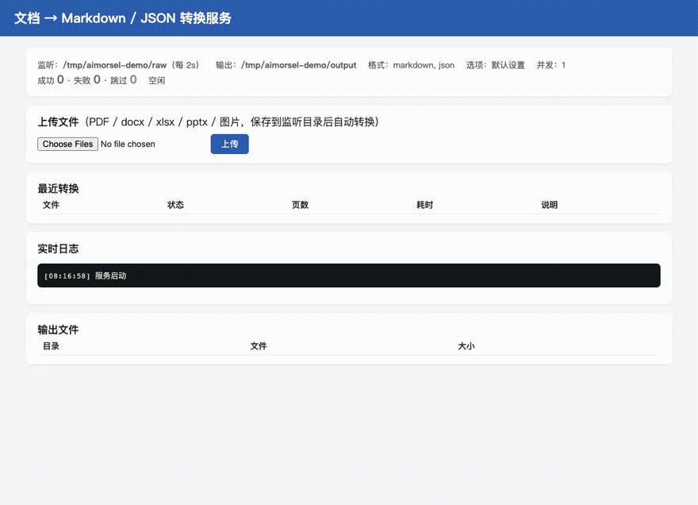

# AImorsel · 文粒

**文档 → Markdown / JSON 转换工具**

**中文**：本页 | **English**: [README.en.md](README.en.md)

一个本地运行的文档结构化提取小工具，把 **PDF、Word（docx）、Excel（xlsx）、
PPT（pptx）、网页（html）和图片** 转成 Markdown、JSON、HTML 或纯文本。
PDF 底层用 [opendataloader-pdf](https://github.com/opendataloader-project/opendataloader-pdf)
做版面分析，在外面包了一层好用的中文交互界面。

**全程离线，文件不出本机**，适合处理论文、报告、合同、课件这类不方便上传到在线服务的文档。


## 它能做什么

从文档里还原出**有结构的内容**，而不是一堆散乱的文字。工具会识别标题层级、段落、
列表、表格；PDF 还保留每个元素的页码、坐标、字体和字号信息。

支持的输入格式：

| 格式 | 说明 |
|---|---|
| `.pdf` | 主路径，版面分析最完整（标题/表格/坐标/字体） |
| `.docx` | Word 文档：标题层级、列表、表格都保留（全文按第 1 页记） |
| `.xlsx` | Excel：每个工作表算一「页」，表格转 Markdown 表格/CSV |
| `.pptx` | PPT：每张幻灯片算一「页」，含演讲者备注 |
| `.html` / `.htm` | 网页：标题/段落/列表/表格按阅读顺序抽取，脚本样式丢弃（全文按第 1 页记，标准库解析零依赖） |
| 图片（png/jpg/tiff/bmp/webp/gif） | 自动包装成 PDF 走 OCR 通道，需启动 OCR 服务才能出文字 |

批量转换、断点续传、RAG 分块、表格导出、监听文件夹等所有功能对全部格式一视同仁——
一个文件夹里混着放也没问题。

两个典型用途：

- **Markdown** —— 干净的正文，直接读、存进笔记库，或者喂给大模型做问答和摘要
- **JSON** —— 完整的结构树，适合写程序做二次处理，比如批量抽取所有表格、按页切片建索引

提供四种用法，转换逻辑完全相同：

| 版本 | 文件 | 适合场景 |
|---|---|---|
| 命令行版 | `morsel.py` | 终端里快速转换、批量处理、写进自动化脚本 |
| 图形界面版 | `morsel_gui.py` | 拖拽文件、点选输出目录，不想碰命令行 |
| Web 常驻服务 | `morsel_web.py` | 挂后台盯文件夹，浏览器里上传/下载 |
| MCP Server | `morsel_mcp.py` | 让 Claude Code 等 Agent 直接读本机文档 |

本页命令都按**从源码运行**写（`python3 morsel.py …`）。装了打包好的安装包之后
命令是 `morsel`，三个副入口走子命令：

```bash
morsel 报告.pdf        # 转换，等同于 python3 morsel.py 报告.pdf
morsel gui             # 图形界面
morsel web             # Web 常驻服务
morsel mcp             # MCP Server（供 Agent 调用）
```

当前目录下真有叫 `gui`/`web`/`mcp` 的文件**或目录**时子命令让位（`web/`、`gui/` 是很常见的
目录名，不能让 `morsel web` 变成起服务），此时会打一行提示，要启动对应功能改用独立命令
`morsel-gui` / `morsel-web` / `morsel-mcp`。

## 环境要求

需要 **Python 3.10+** 和 **Java 11 或更高版本**
（核心引擎 `opendataloader-pdf` 要求 Python ≥3.10）。

Java 是必需的——真正干活的版面分析引擎是 Java 写的，Python 包只是一层调用壳。

```bash
# 确认 Java 已装好
java -version

# 安装依赖
pip install -r requirements.txt
```

如果还没有 Java，macOS 上装一个即可：

```bash
brew install --cask temurin
```

核心依赖是 `opendataloader-pdf`（PDF 引擎，自带 JAR 包）。其余全部可选：
`tkinterdnd2`（GUI 拖拽）、`pdfplumber`（转换失败兜底 + 扫描件快速探测）、
`pikepdf`（结构损坏 / 被截断的 PDF 先修复再转换）、
`python-docx` / `openpyxl` / `python-pptx` / `pillow`（对应 docx/xlsx/pptx/图片输入；HTML 用标准库解析，无需额外依赖）——
缺哪个只影响对应功能，报错里会直接给出安装命令。

## 快速开始

把要转换的文件放进 `raw/` 目录，然后：

```bash
python3 morsel.py
```

按提示选文件、选格式、回车确认，结果就出现在 `output/` 里了。
`examples/sample.pdf` 是随仓库附带的示例文件，拿它试手感最快。


## 命令行版

### 交互模式

不带任何参数运行，工具会自动列出 `raw/` 目录（含子目录）下的所有 PDF，然后依次问三件事：

**第一步，选哪些文件。** 输入编号即可，支持几种写法：

| 输入 | 含义 |
|---|---|
| `2` | 只转第 2 个 |
| `1,3,5` | 转第 1、3、5 个 |
| `1-4` | 转第 1 到第 4 个 |
| `1-3,7` | 混着写也行 |
| `all` | 全部转换 |

也可以不输编号，**直接把 PDF 文件或文件夹从 Finder 拖进终端窗口**再回车。
拖拽产生的转义空格和引号会自动处理，拖文件夹会递归找出里面所有 PDF。

**第二步，选输出格式。** 四个预设，回车用默认的第一个：

1. Markdown + JSON（默认）
2. 仅 Markdown
3. 仅 JSON
4. 全部（Markdown + JSON + HTML + 纯文本）

**第三步，选输出目录。** 回车用默认的 `output/`，也可以拖一个文件夹进来。

### 直接转换

知道要转什么，就跳过交互一步到位：

```bash
python3 morsel.py report.pdf                    # 单个文件
python3 morsel.py raw/                          # 整个文件夹，递归查找
python3 morsel.py a.pdf b.pdf -f markdown       # 多个文件，只要 Markdown
python3 morsel.py raw/ -o ~/Desktop/结果         # 指定输出目录
python3 morsel.py secret.pdf -p 我的密码         # 加密 PDF
```

基础参数：

| 参数 | 说明 | 默认值 |
|---|---|---|
| `-f, --format` | 输出格式，逗号分隔。可选 `markdown` `json` `html` `text` `pdf` | `markdown,json` |
| `-o, --output` | 输出目录 | 项目下的 `output/` |
| `-p, --password` | 加密 PDF 的密码 | 无 |

其中 `pdf` 格式输出的是**标注版 PDF**——在原文上把识别出的每个区块用彩色框标出来，
用于检查版面识别得准不准，排查问题时很有用。

高级参数（第一阶段放出来的底层能力）：

| 参数 | 说明 |
|---|---|
| `--pages 1,3,5-7` | 只转指定页码，大文件省时间 |
| `--images off/embedded/external` | 图片处理：不提取 / 内嵌 Markdown / 存为独立文件（默认 external） |
| `--page-markers` | 在 Markdown/文本里插入分页标记，方便引用溯源 |
| `--better-tables` | 增强表格识别（cluster 模式），无边框表格更准 |
| `--sanitize` | 脱敏：邮箱/电话/身份证/信用卡/IP 替换成占位符 |
| `--header-footer` | 保留页眉页脚（默认丢弃） |
| `--keep-all-content` | 关闭内容安全过滤：被判为隐藏/页外/微小的文字也保留（怀疑内容缺失时用） |
| `--threads N` | 每页并行的线程数，加速大文件（实验特性） |

例如：只转前 3 页、提取图片、开脱敏：

```bash
python3 morsel.py 合同.pdf --pages 1-3 --images external --sanitize
```

OCR 参数（第二阶段能力，处理扫描件，详见下面的「扫描件与 OCR」）：

| 参数 | 说明 |
|---|---|
| `--ocr off/auto/force` | OCR 模式：自动检测扫描件才用（**默认 auto**）/ 不用 / 全部强制 |
| `--ocr-url URL` | OCR 服务地址（默认 `http://127.0.0.1:5002`） |

批量参数（第三阶段能力，文件多时用）：

| 参数 | 说明 |
|---|---|
| `--jobs N` | 并发转换的进程数（默认 1 串行），几十个文件时设 2-4 明显更快 |
| `--force` | 忽略断点续传记录，所有文件都重新转换 |
| `--no-report` | 不生成 `report.csv` 转换报告 |
| `--watch` | 监听模式：持续监视文件夹，新增/修改的 PDF 自动转换，Ctrl+C 退出 |
| `--watch-interval 秒` | 监听扫描间隔（默认 5 秒） |

监听模式示例——盯住 `raw/`，丢进去的 PDF 自动转换（配合网盘同步就是全自动流水线）：

```bash
python3 morsel.py --watch                 # 监听默认的 raw/
python3 morsel.py ~/Dropbox/收件 --watch   # 监听任意文件夹
```

实现上用的是轮询而非 watchdog 库：零额外依赖，且靠「连续两轮文件未变化才转换」
避免转到只拷贝了一半的文件，对网盘同步目录更稳。已转换过的靠断点续传清单跳过。

**断点续传是默认开启的**：每个文件转换成功后都会记进输出目录下的 `.done.json` 清单，
重跑同一批时自动跳过「已完成且源文件没变」的文件——中断后接着跑、往文件夹里加新文件后
重跑，都只转需要转的那部分。源文件改动过（修改时间或大小变化）或换了输出格式/选项，
会自动重新转换，不需要手动干预。

每批转换结束还会在输出目录生成一份 **`report.csv` 转换报告**（Excel 可直接打开）：
每个文件的状态（成功/失败/跳过）、页数、产物数、耗时、是否走了 OCR、失败原因，
批量处理后想知道「哪些没转成、为什么」看这一份就够了。

面向场景加工的参数（第四阶段能力）：

| 参数 | 说明 |
|---|---|
| `--rag-chunks` | 转换后把内容按标题层级 + token 预算切块，输出 `<名>.chunks.jsonl` |
| `--chunk-size N` | 每块的目标 token 数（估算值，默认 400） |
| `--export-tables` | 把识别出的所有表格逐个导出为 CSV，存进 `<名>_tables/`（Excel 直接打开） |
| `--merge` | 转换后把本批文档的 Markdown 按顺序合并成带目录的 `merged.md` |
| `--qa` | 质量自检：标注版 PDF + 逐页统计 `<名>.qa.csv`，标记疑似漏识别页 |

每块是一行 JSON，带引用溯源需要的全部元数据——页码范围、标题路径、token 估算：

```json
{"chunk": 5, "source": "report.pdf", "pages": [1, 1], "heading_path": ["1 基础设施", "1.1 计算集群"], "tokens": 144, "content": "## 1.1 计算集群\n\n……"}
```

切块策略：在标题处开新块（太小的小节自动与后文合并），正文超预算时按行/句切开，
表格渲染成 Markdown 表格。分块和表格导出都基于 JSON 结构树，输出格式里没选 json 时会自动补转。

`--export-tables` 会把每个表格单独存成一个 CSV（文件名带页码，如 `table_1_p2.csv`），
跨行/跨列的单元格填在左上角锚点位置。`--merge` 生成的 `merged.md` 里每份文档占一个
一级标题（原有标题整体降一级），开头有可点击的目录，适合把一系列 PDF 合成一份大文档阅读或检索。

`--qa` 回答「转换结果可信吗、哪些页要人工看看」：生成 **`<名>_annotated.pdf` 标注版**
（在原版面上把识别出的每个区块用彩色高亮标出，标题蓝、正文绿，一眼看出哪里没被覆盖），
同时逐页统计写进 **`<名>.qa.csv`**——无识别结果的标「空白页」，有版面无文字的标
「仅图片（疑似扫描页）」，字符数不足全文档中位数 20% 的标「低密度」。
转换日志里会直接提示「QA：N/M 页疑似需复核」。

交互模式下这些选项会在选完文件和格式后逐个询问，一路回车即用最基础的转换。

### config.toml：常用参数存起来

不想每次敲一长串参数，就把常用组合写进项目根目录的 `config.toml`（已附带一份
全注释的模板，取消注释即生效）：

```toml
[convert]
format = "markdown"
images = "off"

[batch]
jobs = 4

[rag]
enabled = true
chunk_size = 400
```

规则很简单：**配置只是默认值**——命令行显式传的参数永远优先；GUI 启动时用它初始化控件，
之后界面上的改动优先；交互模式（逐项询问）不读配置。写错的键会提示并忽略，不会中断。

## 图形界面版

```bash
python3 morsel_gui.py
```

窗口分四块，从上到下：

1. **拖拽区** —— 把 PDF 文件或文件夹拖进来，文件夹会自动展开
2. **文件列表** —— 显示待转换文件及大小，可以选中移除或一键清空；重复添加同一文件会自动去重
3. **输出设置** —— 勾选格式（可多选），设置输出目录，以及高级选项：
   页码范围、图片处理方式、分页标记、增强表格识别、敏感信息脱敏、保留页眉页脚、
   OCR 模式（默认自动检测扫描件）、并发进程数、断点续传开关、RAG 分块及块大小、
   表格导出 CSV、合并为单个 Markdown、质量自检（控件初始值可用 `config.toml` 配置）
4. **日志区** —— 每个文件的转换结果实时打在这里

转换跑在后台线程，界面不会卡死，进度条实时走。
「并发进程」调到 2 以上可以几个文件同时转；「跳过已转换过且未变化的文件」默认勾选，
重复转同一批时秒完成。每批转完同样会在输出目录生成 `report.csv` 转换报告。
**单个文件失败不会中断整批**，失败原因单独标在日志里，其余文件继续转。
转完可以点「打开输出文件夹」直接跳到 Finder。

## Web 常驻服务

把「文件夹监听」和一个本机网页界面合在一起，适合挂在后台长期跑：

```bash
python3 morsel_web.py                          # 打开 http://127.0.0.1:8008
python3 morsel_web.py --port 9000 --input ~/Dropbox/收件
```

浏览器里可以：**上传文件**（保存进监听目录后自动转换）、看**实时日志**和最近转换结果、
**点击下载**所有产物（Markdown/JSON/CSV/标注 PDF……）。



后台监听线程和 `--watch` 模式同一套逻辑：断点续传去重、文件写完才转换。

零额外依赖（纯 Python 标准库）。转换选项（格式、OCR、并发、RAG 分块等）从
`config.toml` 读取；默认只绑定本机 `127.0.0.1`，需要局域网访问时 `--host 0.0.0.0`
（注意该服务没有访问控制，别暴露到不可信网络）。

## 输出说明

每个 PDF 的产物放进以文件名命名的**子目录**，这样同名文件不会互相覆盖，
将来开启图片提取时附属文件也能归拢在一起：

```
output/
├── report.csv          # 本批转换报告（状态/页数/耗时/失败原因）
├── .done.json          # 断点续传清单（记录已成功转换的文件）
├── 年度报告/
│   ├── 年度报告.md
│   └── 年度报告.json
└── 会议纪要/
    ├── 会议纪要.md
    └── 会议纪要.json
```

### Markdown 长什么样

标题转成 `##` 层级，列表转成 `-`，表格转成标准 Markdown 表格语法，
各种语言的变音符号（如德语 `ü`、法语 `é`）都完整保留。就是一份能直接读的干净正文。

### JSON 长什么样

顶层是文档元信息，`kids` 里是嵌套的元素树：

```json
{
  "file name": "report.pdf",
  "number of pages": 12,
  "author": null,
  "title": null,
  "creation date": "D:20260721151544Z00'00'",
  "kids": [
    {
      "type": "paragraph",
      "pdfua_tag": "P",
      "id": 1,
      "page number": 1,
      "bounding box": [16.6, 760.2, 167.8, 775.2],
      "font": "Helvetica",
      "font size": 12.0,
      "text color": "[0.0, 0.0, 0.0]",
      "content": "这里是段落正文"
    }
  ]
}
```

元素类型包括 `heading`（标题）、`paragraph`（段落）、`list` / `list item`（列表）、
`table` / `table row` / `table cell`（表格）、`text block`（文本块）。

`bounding box` 是 `[左, 下, 右, 上]` 四个坐标，原点在页面左下角，单位是 pt（1/72 英寸）。
有了坐标就能做很多事：判断内容在页面上的位置、还原多栏排版、把提取结果标回原图。

一份 20 页的技术文档大致能解析出几百个段落、十几个表格和上千个单元格。

## 项目结构

```
aimorsel/
├── morsel.py           # 命令行版，也是核心转换逻辑 + 格式路由所在
├── morsel_gui.py       # 图形界面版，复用 morsel.py 的转换函数
├── morsel_web.py       # Web 常驻服务版（监听文件夹 + 浏览器界面）
├── format_adapters.py  # 多格式适配器（docx/xlsx/pptx/HTML 解析、图片包装 PDF）
├── packaging/          # 打包脚本（build.sh + PyInstaller spec + 精简 JRE）
├── config.toml         # 常用参数默认值（模板全注释，按需启用）
├── requirements.txt    # 依赖声明
├── README.md           # 本文件
├── raw/                # 放待转换的文件（默认扫描目录）
└── output/             # 转换结果
```

各版本共用同一套转换逻辑：GUI/Web 直接 import 了 `morsel.py` 里的
`convert_one()` 和 `find_inputs()`。改转换行为只需要动 `morsel.py` 一处，其余会跟着变。

### 工作原理

```
PDF → Java 引擎（版面分析）→ 结构树 → Markdown / JSON / HTML / 文本
```

`opendataloader-pdf` 这个 Python 包内置了一个 JAR，调用时它起一个 JVM 子进程来干活。
本工具在这之上主要做了三件事：

1. **交互和批量** —— 文件发现、编号选择、拖拽路径解析、批量调度
2. **错误处理** —— 底层出错时会把完整的 java 命令行吐到终端，非常难读；
   这里把它拦截下来，只提取真正的原因（如 `'x.pdf' is not a valid PDF file`）
3. **输出组织** —— 按文件名分子目录，失败时清理掉刚建的空目录

## 扫描件与 OCR

普通 PDF 里有文字层，直接就能提取。但**扫描件**（拍照或扫描生成的、整页都是图片的 PDF）
没有文字层，普通转换会得到空文件。这时需要 **OCR**（光学字符识别）把图片里的字认出来。

本工具通过 opendataloader 的 **hybrid 后端**支持 OCR。它是一个独立的本地服务，因为要跑
OCR 模型（依赖较重），所以**按需启动**，不装也不影响普通转换。

### 一键安装（推荐）

```bash
python3 morsel.py --setup-ocr          # 自动建独立环境、装依赖（几个 GB）、启动服务
python3 morsel.py --stop-ocr           # 停止服务
```

GUI 里也有「启用扫描件支持…」按钮，Web 界面同样有对应按钮——点一下等装完即可，
进度打在日志区。依赖装在 `~/.aimorsel/ocr-env` 独立环境里，不污染系统，卸载 = 删该目录。
识别语言默认 `ch_sim,en`，可用 `--setup-ocr-lang "de,en"` 指定（**必须匹配文档语言**）。

### 手动启动（备选）

```bash
# 安装 OCR 依赖（会拉一些较大的包，第一次装耐心等）
pip install "opendataloader-pdf[hybrid]"

# 启动服务，指定中英文识别（默认端口 5002）
opendataloader-pdf-hybrid --port 5002 --ocr-lang "ch_sim,en"
```

服务跑起来后，另开一个终端用工具转换即可。

> **`--ocr-lang` 必须和文档语言匹配**，这是实测中影响识别质量最大的因素：
> 用中文模型识别德语文档时变音符号全错（ü→ii）、丢行严重；换成 `de,en` 后明显改善。
> 常用语言代码：`ch_sim`（简体中文）、`en`、`de`、`fr`、`ja` 等（easyocr 语言表）。

### 三种 OCR 模式

```bash
# auto：自动检测，只有疑似扫描件才走 OCR（默认，普通 PDF 不受影响）
python3 morsel.py raw/

# force：所有文件都强制走 OCR
python3 morsel.py 扫描件.pdf --ocr force

# off：完全不用 OCR，也不探测服务
python3 morsel.py raw/ --ocr off
```

- **auto** 模式下，工具会先快速探测每个文件的文字密度：文字正常的直接普通转换，
  几乎没有文字的判定为扫描件、交给 OCR。这样一批混合文档里，只有真正需要的文件才走 OCR。
- 如果 OCR 服务**没启动**，工具不会报一堆连接错误，而是明确提示你怎么启动，
  并把文件降级为普通模式转换（扫描件可能仍为空，但不会中断整批）。
- **图片输入在 OCR 没启动时转出来必然没有文字**（只有一张图的版面）。这种结果**不算成功**：
  日志标 `△`、`report.csv` 状态列是「降级转换」、汇总行会数出「其中 N 个降级/无文字」，
  说明列写明原因；Web 面板和 MCP 工具结果里同样能看到。清单里会记它「等 OCR」——**启动服务后直接
  重跑同一命令就会自动补转**，不用 `--force`（监听模式也一样，服务上线后的下一轮自动补）。
  服务在线但 OCR 也认不出字的图最多自动重试两次，之后当作空白图不再重转。
- OCR 出错时会**自动退回** Java 引擎，保证不会让整批转换失败。

GUI 里同样在「输出设置」的 OCR 一栏选择关闭 / 自动检测 / 全部强制。

> 提示：OCR 比普通转换慢不少（要跑模型），auto 模式能帮你只在必要时付出这个代价。

### 真实效果如何（已实测）

用合成扫描件和一份真实扫描的 8 页德语数学试卷（印刷体 + 公式 + 手写标记）实测过
docling-fast 后端（CPU，约 6 秒/页）：

- **印刷体正文可靠**：英文近乎全对；中文正常字号全对，过小的字号（约 28px 以下）会丢行
- **语言设置是关键**：见上面 `--ocr-lang` 的说明
- **数学公式基本丢失**，手写标记基本忽略——扫描件 OCR 的结果适合**检索和定位**
  （「这份文件讲了什么、关键词在第几页」），不适合当作忠实还原的全文

### ⚠️ 已知限制：扫描件里的数字不可直接采信

**扫描件转出来的金额、比例、日期等数字，必须回原件核对后才能使用。**
这不是「可能有点误差」，而是**会静默出错**——错值长得和对值一模一样，
不看原件无从发现，转换日志里也不会有任何警告：

| 原件 | 转换结果 | 错在哪 |
|---|---|---|
| `132,704,932.32` | `132,701,932.32` | 中间一位 4→1 |
| `45,248,081,505.77` | `45,218,081,505.77` | 同一份里系统性把 4 认成 1 |
| `-248,151.42` | `248,151.42` | **负号被吃掉，亏损变盈利** |
| `9.33` | `9` + `33` | 小数点丢失，一个数裂成两个 |

我们用 20 份真实上市公司财报扫描件量过（`bench/` 评测集，指标 `数字F1`）：
**输出的数字里约 23% 在原文中根本不存在**（`数字准` 0.773），原文的数字只有约 59% 被原样转出。
同一批文件的文本相似度是 0.59——**文本指标看着「中等偏上」，数字却已经不能用了**，
因为改一位数在字符层面只是一个字符的差异。

这是 OCR 后端的能力边界（同一批文件上 docling 也错），换模型能改善但消除不了。
所以：**扫描件的转换结果适合检索、定位、做全文索引；凡是要进表格、进计算、进报表的数字，
一律以原件为准。** 有文字层的 PDF（非扫描件）不受此限制——那条路径不经过 OCR。

## 评测：和别的工具比，处在什么位置

先说结论：**格式覆盖面和速度是强项；纯文本保真度与 docling / pymupdf4llm 打平；
扫描件和图片是所有工具共同的短板，也是我们自己最弱的地方。**

评测集在 [`bench/`](bench/)：语料清单、下载脚本、真值生成器、指标实现（每个指标都有单元测试）、
跑批脚本和完整结果表全部入库，同一份 manifest 重跑误差 < 1%。
**完整结果与口径说明见 [`bench/RESULTS.md`](bench/RESULTS.md)**——那份表开头有 8 条
「不知道就会读错」的口径说明（公式怎么算、表格标记怎么影响相似度、哪些引擎只跑了子集），
下面引用的数字都以它为准。

### 语料：731 份 × 5 个引擎 = 3224 条记录

- **来源**：真实文档 542 份，取自 12 个公开来源——arXiv（CC-BY 子集，附 LaTeX 源码）、
  EUR-Lex（多语平行文本）、联合国 ODS（同一份文件六种官方语言）、SEC EDGAR 10-K、
  巨潮资讯网年报、OpenStax 教材、IETF RFC、日本 e-Gov 法令、德国 gesetze-im-internet、
  FUNSD / XFUND 扫描表单等；另有 189 份程序化生成的合成件（结构真值 100% 已知）
- **格式**：PDF 文字层 253 · 扫描 PDF 40 · 图片 188（png 66 / jpg 81 / tiff 41）·
  HTML 172 · docx 36 · pptx 21 · xlsx 21
- **语言**：英 227 · 中 143 · 德 94 · 西 84 · 法 74 · 日 64 · 俄 27 · 阿 18
- **领域**：法律 205 · 工商财报 186 · IT 114 · 数学与学术 91 · 政务 75 · 教育 44 · 医学 8 · 新闻 8
- **真值**：628 份是「精确档」——直接从源文件解析（arXiv 的 LaTeX 源码、EUR-Lex/RFC 的 HTML 版、
  合成件的已知结构），**不是人工打分，也不用大模型当裁判**；其余 103 份无源文件的
  （政务、财报 PDF）用五个引擎的共识段落做伪真值，只用于相对比较

### 指标含义

| 指标 | 含义 |
|---|---|
| 字符相似 ↑ | 与真值的字符级相似度（0–1，去空白后比） |
| CER ↓ | 字符错误率 |
| 标题 F1 ↑ | 标题文本集合的匹配 F1（模糊匹配 ≥ 0.9） |
| 单元格 F1 ↑ | 表格对齐后逐格文本 F1 |
| 顺序 τ ↑ | 段落阅读顺序的 Kendall τ |
| 数字 F1 ↑ | 数字串多重集的 P / R / F1；**`1 − 数字准` 就是凭空造出来的错值占比** |
| 兼容码位残留 ↓ | 康熙部首、兼容表意字、连字这类「肉眼一样、grep 不到」的码位数，应为 0 |
| RTL 视觉序 ↓ | 阿拉伯语等被按视觉序存下来（字不缺但检索全废）的文档份数，应为 0 |
| 秒/文档、峰值内存 | 中位数与 p95，同一台 macOS（M 系列 CPU，无 GPU） |

### 覆盖面：731 份里各自能转成功多少

| 引擎 | 能吃的输入 | 731 份里成功 | 兼容码位残留 | RTL 视觉序 |
|---|---|---|---|---|
| **AImorsel** | 全部 8 类格式 | **731（100%）** | 0 | 0 / 25 |
| docling | 与我们相当（只跑了 300 份分层子集，约 11 s/份，全量跑不完） | 299 / 300 | 0 | 0 / 6 |
| pymupdf4llm | 只吃 PDF | 293（40.1%） | 0 | 0 / 10 |
| markitdown | 除图片/扫描件外的多数格式 | 539（73.7%） | 4 | 10 / 25 |
| pdfplumber 纯文本 | 只吃 PDF | 289（39.5%） | 0 | 10 / 10 |

「不支持的格式」按失败计——这一列衡量的是「一个混装文件夹丢进去，多少份能出东西」。
最右两列是**静默事故**：markitdown 与 pdfplumber 把 10 份阿拉伯语文档按视觉序输出，
字一个不少，但 grep 和分词全部失效。

### 质量：与各引擎在「双方都成功」的文档上逐对比较

| 对手 | 共同份数 | 字符相似（对手 / 我们）| CER（对手 / 我们）| 秒/文档（对手 / 我们）|
|---|---|---|---|---|
| docling | 299 | 0.841 / **0.839** | 0.209 / **0.201** | 11.2 / **0.47** |
| pymupdf4llm | 293 | 0.775 / **0.773** | 0.339 / **0.316** | 7.2 / **1.67** |
| markitdown | 539 | 0.715 / **0.842** | 0.342 / **0.215** | 0.82 / 0.47 |
| pdfplumber | 289 | 0.574 / **0.778** | 0.512 / **0.302** | 0.47 / 1.66 |

**与 docling、pymupdf4llm 在文本保真度上基本持平，耗时差一个数量级**（docling 中位 11.2 秒/份、
峰值内存 p95 2.0 GB；我们 1.59 秒/份、620 MB）。对 markitdown 和 pdfplumber 则是全面领先。

另有一张「77 份所有引擎都成功」的交集表（`RESULTS.md` 的「公平对比」），
样本小且偏向标准单栏 PDF，**那张表上 docling 0.924、pymupdf4llm 0.918 高于我们的 0.824**；
结构指标则是我们领先（标题 F1 0.965、单元格 F1 0.962、数字 F1 0.912）。两张表都摆出来，
读的时候注意样本差异。

### 已知短板

1. **扫描件与图片是最弱的一环**。png 子集字符相似 0.558（docling 0.727）、
   jpg 0.750（docling 0.798）；字符相似度最低的 30 份里 29 份是图片输入。
   这条通道的上限由 OCR 后端决定，不是版面分析。
2. **扫描件里的数字会静默出错**：数字 F1 在有文字层的文档上是 0.891，走 OCR 通道只有 0.716。
   详见上面「⚠️ 已知限制：扫描件里的数字不可直接采信」一节。
3. **图片/扫描通道不做表格重建**（表被拍平成逐行文本，`单元格 F1 = 0`），
   而且同一行的单元格可能被打乱——已定位为上游 Java 引擎重排阅读顺序时的问题，我们这层没有介入点。
4. **PDF 里的公式不还原成 LaTeX**（HTML 输入可以）。PDF 里公式早已是字形，
   目前没有引擎能从中还原 LaTeX；`domain = math` 那一栏所有引擎的分数都低，
   量的是「这篇公式有多密」，不是文本保真度。
5. **阿拉伯语的 lam-alef 连字仍有歧义**（`الأمم` 会出成 `األمم`），与 pymupdf4llm 同等水平。

这些都在公开仓库里开着 `known-limitation` 标签的 issue，不藏。

### 读这些数字时请注意

- **docling 只跑了约 300 份分层子集**（按格式 × 语言轮转、固定种子），它那一行的份数与别人不同，
  不能直接和总表均值比——所以上面用的是逐对交集表。
- **pymupdf4llm 在无文字层 PDF 上会自动调用本机 Tesseract**，它在扫描件一栏的分数是
  Tesseract 的 OCR 成绩，换一台没装 tesseract 的机器数字会变。
- **字符相似度会被 Markdown 表格标记拉低**：表格密集的文档里，产物的 `|` 分隔符算进了字符差异
  （实测出现过字符相似 0.94 而词级 CER 0.0005 的组合）。表格密集文档以 CER 与单元格 F1 为准。
- 评测跑在 macOS（M 系列 CPU，无 GPU），所有引擎全程离线、单文档超时 300 秒。

## 常见问题

**提示 `'java' command not found`**
转换引擎依赖 Java，装一个 JDK 11+ 即可，见上面的「环境要求」。

**某个 PDF 转换失败**
最常见的是文件损坏或根本不是 PDF，日志会提示 `missing %PDF- header`。
加密 PDF 需要用 `-p` 传密码。失败只影响该文件，同批其余文件照常转换。
引擎报 `is not a valid PDF file (corrupted or truncated content)` 的文件（下载到一半的、
交叉引用表坏掉的）会自动用 `pikepdf` 修复结构再喂一次引擎——修得好就是**完整结构树、不算降级**，
说明列写「PDF 结构损坏，已修复后转换」；修不好才落到 pdfplumber 纯文本兜底。没装 `pikepdf` 则跳过这一步。

**网页里的公式去哪了**
HTML 输入里的 MathML 公式（维基百科等）会以 LaTeX 文本形式保留：行内 `$n-1$`、独立公式 `$$…$$`
自成一行（优先取 `<annotation encoding="application/x-tex">`，其次 `alttext`，最后 MathML 词元拼接；
只有回退图片的取 `alt`）。

**重跑时有些文件被跳过了**
这是断点续传在起作用：该文件此前已成功转换、源文件和选项都没变，就不再重复劳动。
想全部重转就加 `--force`（GUI 里取消勾选「跳过已转换过且未变化的文件」）。

**GUI 里拖不进文件**
说明 `tkinterdnd2` 没装成功，`pip install tkinterdnd2` 即可。
不装也能用，改用「添加文件」按钮就行。

**扫描件转出来是空的**
这类 PDF 里只有图片、没有文字层，需要 OCR 才能提取。用 `--ocr auto` 并启动 OCR 服务即可，
详见上面的「扫描件与 OCR」。

**表格识别得不准**
底层默认用「边框检测」找表格，对无边框表格效果有限。
可以试试 cluster 模式，见下面迭代计划的第一阶段。

**扫描的财报 / 发票 / 报表，数字能直接用吗**
不能。扫描件里的数字会静默出错（负号丢失、个别数位被认错），详见上面
「⚠️ 已知限制：扫描件里的数字不可直接采信」。

**中文 PDF 的效果**
中文文档正常支持。如果出现乱码或方块字，通常是 PDF 里嵌的字体没有正确的编码映射，
这种情况底层引擎也无能为力，属于源文件的问题。

## 后续迭代计划

按投入产出比排序，前面的性价比更高。底层引擎的能力其实远超目前暴露出来的这些，
很多功能只是加几个参数的事。

### 第一阶段：把底层已有的能力放出来 ✅ 已完成

`opendataloader_pdf.convert()` 支持三十多个参数，MVP 只用了四个。这一阶段把最实用的几个
接了出来，CLI 和 GUI 都能用（用法见上面的「高级参数」和「图形界面版」小节）：

- ✅ **提取图片** —— `--images external` 把插图存成 PNG 文件，`embedded` 内嵌 Markdown，`off` 不提取
- ✅ **指定页码范围** —— `--pages 1,3,5-7`，只转需要的部分
- ✅ **分页标记** —— `--page-markers`，在 Markdown/文本里插入「第 N 页」分隔，方便引用溯源
- ✅ **增强表格识别** —— `--better-tables`（cluster 模式），无边框表格更准
- ✅ **敏感信息脱敏** —— `--sanitize`，邮箱/电话/身份证/信用卡/IP 替换成占位符
- ✅ **保留页眉页脚** —— `--header-footer`，默认丢弃
- ✅ **多线程加速** —— `--threads N`，按页并行（实验特性，暂只在 CLI 暴露）

> 一个已知限制：`--images embedded` 是否真把图内嵌进 Markdown，取决于底层对图片的版面判定，
> 对某些图不会内嵌；`external` 模式则能稳定导出图片文件。

### 第二阶段：OCR 支持（扫描件）✅ 已完成

纯图片型 PDF 转出来是空的，这一阶段接了 hybrid 后端做 OCR，用法见上面的「扫描件与 OCR」。
落地的三件工程实事：

- ✅ **自动检测扫描件** —— `--ocr auto` 先探测每页文字密度（转一次 json 统计字符数/页数），
  低于阈值才判定为扫描件走 OCR，普通 PDF 不受影响、不白白增加耗时
- ✅ **服务未启动友好提示** —— 不抛连接错误，而是明确告诉用户 `pip install` 和启动命令，
  并把文件降级为普通模式转换，不中断整批
- ✅ **fallback 兜底** —— 注入 `hybrid_fallback=True`，OCR 后端出错时退回 Java 引擎

> 说明：OCR 服务本身依赖较重（torch/docling），未打进本项目，由用户按需 `pip install`。
> 本项目实现并验证的是「检测 + 对接 + 降级」这套框架（用 mock 服务确认了健康检查、
> 参数注入、底层真实发起 OCR 请求、fallback 降级）；真实 OCR 识别质量需装 hybrid extra 后自测。

### 第三阶段：批量场景的工程化 ✅ 基本完成

文件一多，串行 + 无状态就不够用了。这一阶段落地的能力（用法见上面的「批量参数」）：

- ✅ **断点续传 + 增量转换** —— 成功记录写进输出目录的 `.done.json` 清单
  （源文件 mtime/大小 + 选项签名），重跑自动跳过没变化的，改过的文件自动重转；
  每成功一个就落盘，中途 Ctrl+C 或断电都不丢进度。`--force` 可全部重转
- ✅ **并发转换** —— `--jobs N` 用 `ProcessPoolExecutor` 多文件同时转
  （每个转换本来就是独立的 Java 子进程，进程池天然干净），GUI 里对应「并发进程」
- ✅ **转换报告** —— 每批生成 `report.csv`：状态/页数/产物数/耗时/OCR/失败原因，
  utf-8-sig 编码 Excel 直接打开
- ✅ **配置文件** —— 常用参数组合存进 `config.toml` 作为默认值，命令行传参可覆盖，
  GUI 也用它初始化控件（用法见上面的「config.toml」小节）

另外从这一版起 **OCR 默认就是 auto**：不加任何参数也会自动检测扫描件，
服务没启动则安静降级为普通转换。

### 第四阶段：面向使用场景做加工（进行中）

到这一步就不只是格式转换了，而是围绕具体用途做后处理：

- ✅ **喂给大模型（RAG 分块）** —— `--rag-chunks` 按标题层级 + token 预算切块，
  输出 `chunks.jsonl`，每块带页码范围和标题路径作为引用元数据
- ✅ **表格单独导出** —— `--export-tables` 把所有表格逐个存成 CSV（utf-8-sig，
  Excel 直接打开），处理财报、数据附录时特别实用
- ✅ **合并多份文档** —— `--merge` 把一个系列的 PDF 合成一份带目录的大 Markdown
- ✅ **质量自检** —— `--qa` 生成标注版 PDF 做可视化校验，并逐页统计标记
  空白页/仅图片页/低密度页，提示哪些页需要人工复核（用法见上面的参数表）

### 更远一些

- ✅ **打包成独立应用** —— `packaging/build.sh` 一键构建 `dist/morsel/`：
  CLI（`morsel`）、图形界面（`morsel-gui`）、Web 服务（`morsel-web`）、MCP（`morsel-mcp`）四个可执行
  共享一份依赖，**内置 jlink 精简 JRE（约 51MB），目标机器不用装 Java 和 Python**，
  整包约 112MB。`raw/`、`output/`、`config.toml` 都在可执行文件旁边。
  注意：未做代码签名（其他 Mac 首次打开需在「系统设置-隐私与安全性」放行），
  只适用同架构 macOS（Apple Silicon），OCR 服务（docling）不在包内、仍需单独安装
- ✅ **本地 Web 界面** —— `morsel_web.py` 已实现（纯标准库，见上面的「Web 常驻服务」），
  监听 + 上传 + 日志 + 产物下载一体；想换更现代的桌面 GUI（PySide6）仍可另议
- ✅ **监听文件夹** —— `--watch` 盯着某个目录，丢进去的 PDF 自动转换，
  配合网盘同步就是一个全自动的文档处理流水线（轮询实现，零额外依赖，
  用法见上面的「批量参数」）

## 许可

本项目以 [Apache License 2.0](LICENSE) 开源。
底层引擎 [opendataloader-pdf](https://github.com/opendataloader-project/opendataloader-pdf)
同为 Apache-2.0，其余依赖均为 MIT 系宽松许可。
